# LPOO1617_T5G9 - Final Project
Francisco Teixeira Lopes - 201106912 - ei11056@fe.up.pt

David Alexandre Gomes Reis - 201607927 - up201607927@fe.up.pt

On this document, TwinStickShooter is mentioned as TSS and TwinStickShooterController is mentioned as TSSC.

# Development Documentation

[Architecture Design](Docs/Architecture%20Design.pdf)

[GUI Design](Docs/GUI%20Design.pdf)

[Test Design](Docs/TestDesign.pdf)

# Setup and Installation

## Setting up the develpment environment

### Requirements:
- JDK
- Android SDK
- IntelliJ IDEA is recommended and used in this guide, although other IDE's with similar capabilities should also work.
 
### Step-by-step (Works for TSS and TSSC):
- On IntelliJ, press "Open Project" and open the build.gradle file on the project root directory.
- Select "Open as Project."
- On the window that pops up, untick "Create separate module per source set" and set up your Gradle JVM. Leave everything else on default settings and press "OK".
- Wait for Gradle and IntelliJ to load and configure the project.
- If your Android SDK is not set up, go to File -> Project Structure, click the "New" button, press "Android SDK" and choose your Android SDK path. You might need to update your SDK, go to your SDK Manager to do that.
- You should now have an Android run configuration with the following configuration:
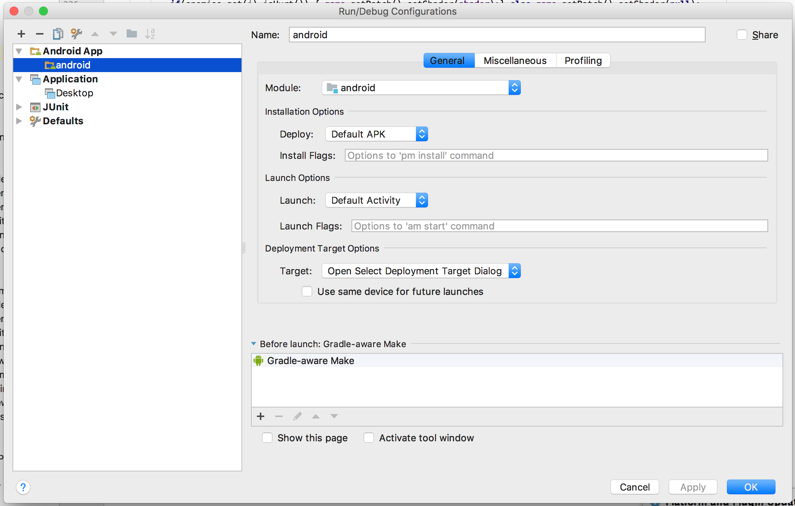
- To run on Desktop, create the following run configuration:
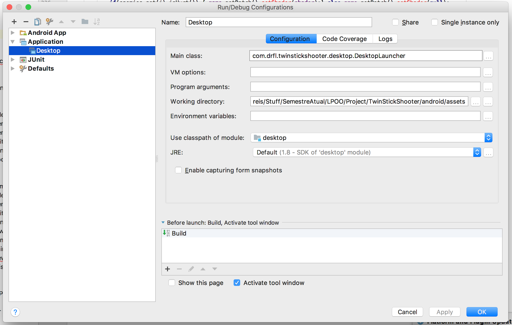
- To run the unit tests, create the following run configuration:
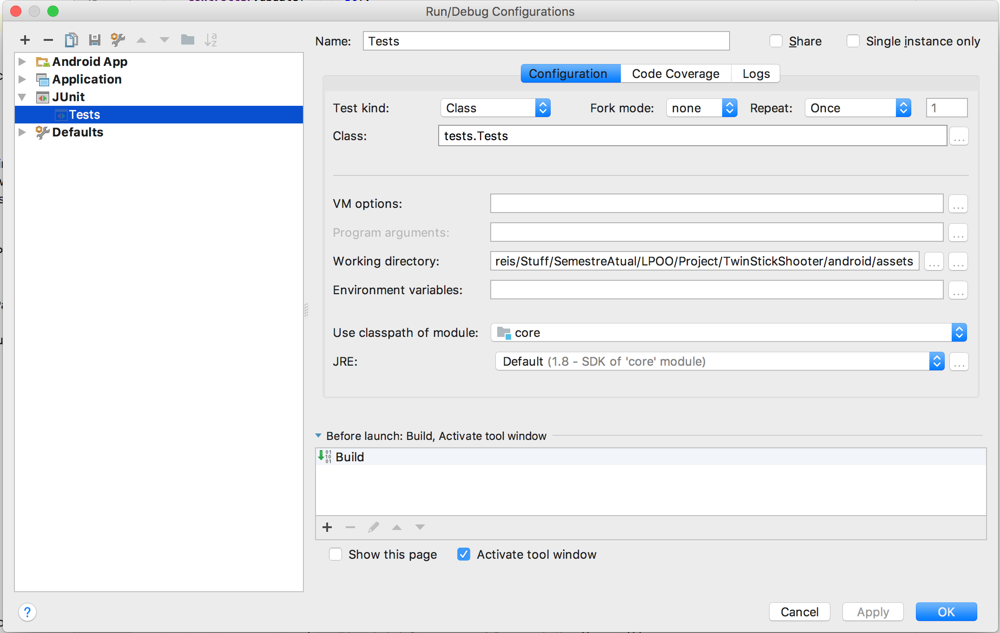
- Please note that TSSC is only meant to only run on Android, and TSS is only meant to run as a Desktop Application. Running these applications on other platforms will almost certainly cause them to misbehave.

# User Manual

## TSS
- Firstly, you will be presented to the main menu.
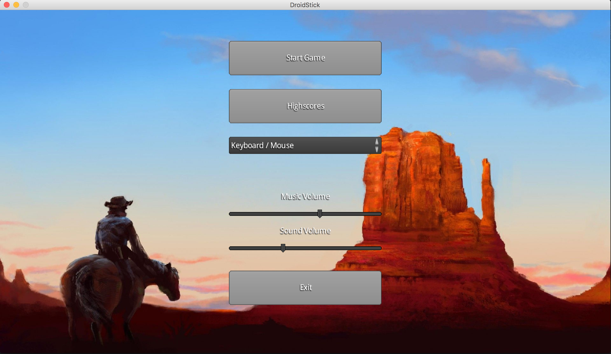
- The first thing you should do is choose the input with which you will control the character in-game. To do that, you should choose from the dropdown menu, which will give you the following options:
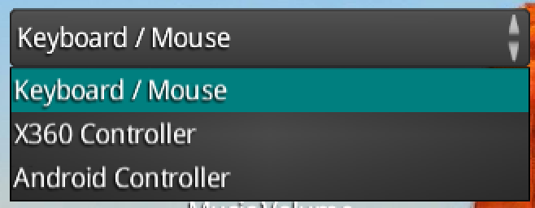

### Keyboard / Mouse
- With this input mode you control the in-game character using the WASD keys on your keyboard, using your mouse to aim and shoot bullets.

### X360 Controller
- With this input mode you control the in-game character using a XBOX360 controller. [BUTTONS???]???????
- Please note that you must plug-in the controller before running the application.

### Android Controller
- With this input mode you control the in-game character using an Android App, which is described in greater detail [here](#tssc), transmiting data with a server-client connection. This app is the server, and the Android App is the client.
- When you select this input mode, the local IP will be appear on the screen for your convenience, as you will need to insert it on the Android App.
- Under the input dropdown, you will see a red message until you run and connect the Android App, which will make the message disappear.
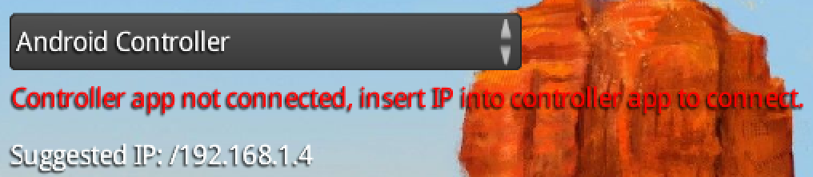
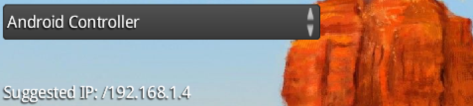

- You can change the music and SFX volume using two sliders, located below the Input Dropdown.
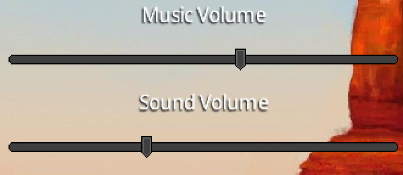

- Pressing "Start Game" will take you to the map selection screen, which shows the preview of the 3 maps available. After selecting the map, the game will start.

### In-Game
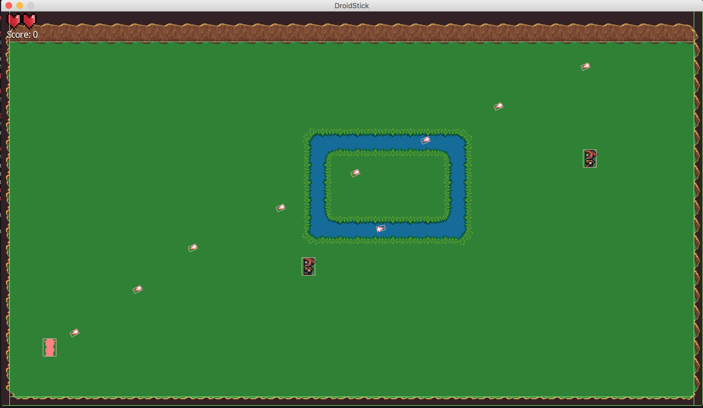
- The objective of the game is to shoot and kill as many enemies as you can without being hit by their bullets.
- You can control the character using the input mode selected on the Main Menu.
- On the top left corner of the screen you can see your Health and your Score, which is determined by how many enemies you've killed so far.
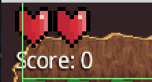

### After the Game
- This is an "endless" type of game, so the only way to finish the game is to die.
- When you die, a Game Over screen is shown for a few seconds.
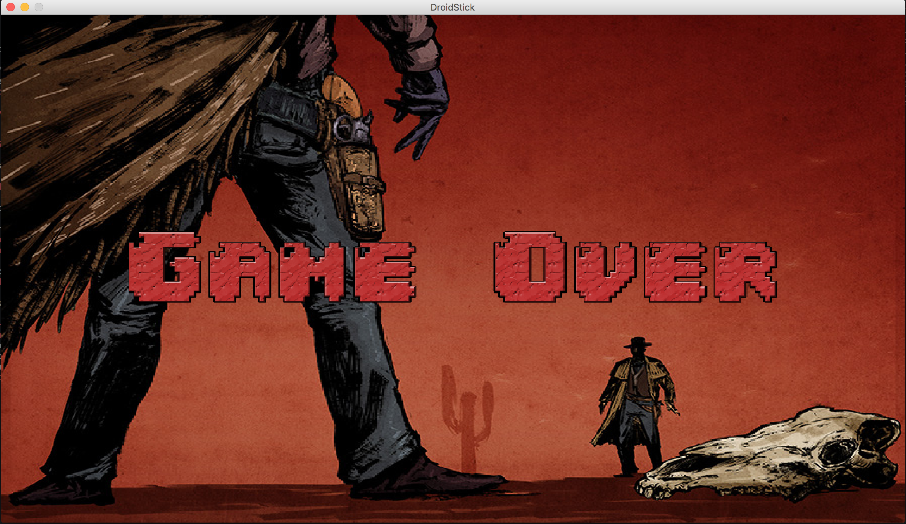
- AFter that you will be taken to a Highscores screen, which show the highest scores ever achieved on your computer, as well as the date of the highscore and the name of the user who achieved it.
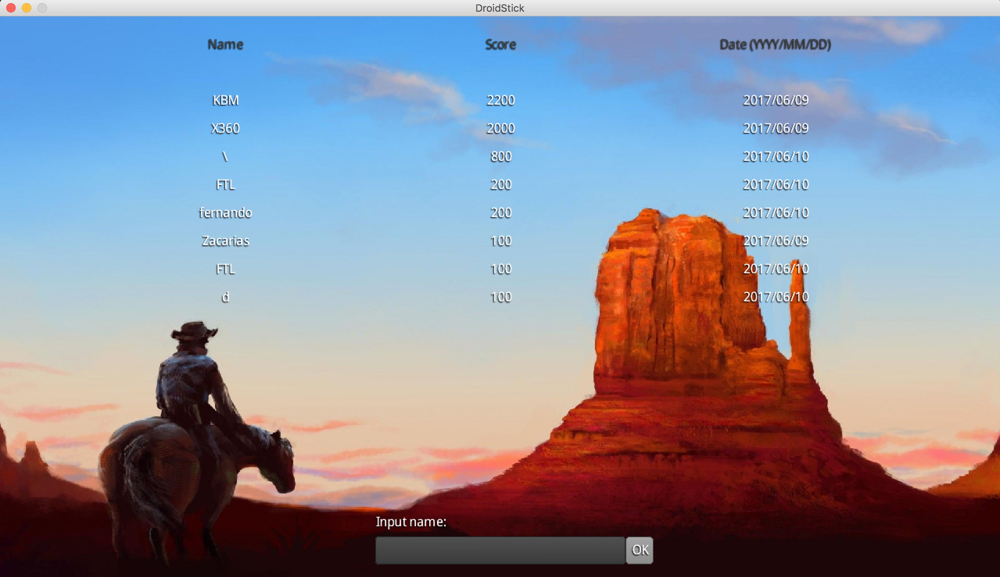
- Insert your username on the textfield located on the bottom of the screen and press "OK" to add your score to the list and return to the Main Menu.
- You can also access the Highscores screen by pressing the "Highscores button on the Main Menu"

## TSSC

