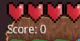

# LPOO1617_T5G9 - Final Project

Francisco Teixeira Lopes - 201106912 - ei11056@fe.up.pt

David Alexandre Gomes Reis - 201607927 - up201607927@fe.up.pt

On this document, TwinStickShooter is mentioned as TSS and TwinStickShooterController is mentioned as TSSC.

# Intermediate Delivery Documentation

[Architecture Design](Docs/Intermediate/Architecture%20Design.pdf)

[GUI Design](Docs/Intermediate/GUI%20Design.pdf)

[Test Design](Docs/Intermediate/TestDesign.pdf)

# Setup and Installation
## Setting up the development environment
### Requirements:
- JDK
- Android SDK
- IntelliJ IDEA is recommended and used in this guide, although other IDE's with similar capabilities should also work.
 
### TSS (Desktop)
- On IntelliJ, press "Open Project" and open the build.gradle file in the project root directory.
- Select "Open as Project."
- On the window that pops up, untick "Create separate module per source set" and set up your Gradle JVM. Leave everything else on default settings and press "OK".
- TSS should be executed on Desktop, create the following run configuration:

- To run unit tests, create the following run configuration:

### TSSC (Android)
- On IntelliJ, press "Open Project" and open the build.gradle file in the project root directory.
- Select "Open as Project."
- On the window that pops up, untick "Create separate module per source set" and set up your Gradle JVM. Leave everything else on default settings and press "OK".
- Wait for Gradle and IntelliJ to load and configure the project.
- If your Android SDK is not set up, go to File -> Project Structure, click the "New" button, press "Android SDK" and choose your Android SDK path. You might need to update your SDK, go to your SDK Manager to do that.
- You should now have an Android run configuration with the following configuration:

# User Manual
## TSS
### Main Menu
- Firstly, the main menu will show on-screen.

- The first thing you should do is choose the input with which you will control the character in-game. To do that, you should choose from the input dropdown menu, which will give you the following options:

#### Keyboard / Mouse
- With this input mode you control the in-game character using the WASD keys on your keyboard, using your mouse to aim and shoot bullets.

#### X360 Controller
- With this input mode you control the in-game character using an XBOX360 controller, the left thumbstick controls movement and the right thumbstick controls shooting direction.
- Please note that you must plug-in the controller before running the application, otherwise the game won't detect the controller and an error message will be displayed on the screen.

#### Android Controller
- With this input mode you control the in-game character using an Android App, which is described in greater detail [here](#tssc), transmitting data with a server-client network connection. This app is the server, and the Android App is the client.
- When you select this input mode, the most likely IP address will appear on-screen for your convenience, as you will need to insert it on the Android App. In case it doesn't work, the IP needed is from the local network and both devices should be connected, be it from WAN/LAN or the same subnet.
- Under the input dropdown, you will see an error message until you run and connect the Android App.

Before Connection:

After Connection:

- You can change the music and SFX volume using two sliders, located below the Input Dropdown.

- Pressing "Start Game" will take you to the map selection screen, which shows the preview of the 3 maps available. After selecting the map, the game will start.

### In-Game

- The objective of the game is to shoot and kill as many enemies as you can without being hit by their bullets.
- You can control the character using the input mode selected on the Main Menu.
- On the top left corner of the screen you can see your Health and your Score, which is determined by how many enemies you've killed so far.

### After the Game
- This is an arcade survival game, there is no "Win" condition and the objective is to beat the top high score.
- When you die, a Game Over screen is shown for a few seconds.

- If you managed to beat a high score then you'll be taken to the Highscores screen, which shows the highest scores ever achieved on your computer, as well as the date of the highscore and the name of the user who achieved it.

- Insert your username on the text field located on the bottom of the screen and press "OK" to add your score to the list and return to the Main Menu.
- You can also access the Highscores screen by pressing the "Highscores" button on the Main Menu.

## TSSC
- Before following these steps you should start TSS and choose Android Controller as your input mode, as described [here](#tss).

### Connection Menu
- Firstly, the connection menu will appear. On this menu you will be able to connect to your running TSS Desktop application.

- On this menu there is a text field where you should insert the IP Address of the computer that is running TSS.
- After inserting the IP Address, press the "Enter" button to attempt to connect.
- If the connection fails, an error message will be shown on the screen to help you identify the problem.

- You can try to connect again by following the same steps.
- If the connection succeeds, you will be taken to the controller menu.

### Controller Menu
- The controller menu is where you are able to effectively control the character.
- The controller itself has two sticks, the left one controls the character movement and the right one controls the shooting direction.

- Every time you move one or both sticks a packet will be sent to TSS, which will trigger and execute the appropriate action (Move character / Shoot bullet).

#Major Difficulties

One of the biggest challenges we had to overcome during the development of this project was to employ an architectural pattern that allowed us to write clean and well structured code. The pattern we chose was the `Model View Controller` architectural pattern. This was a big priority since the start of the development process because we knew, both from what we learned from previous experiences and from the LPOO lectures, that having a good architecture which allowed us to couple components loosely would make our whole development process a lot easier and faster, and would also allow us to easily implement unit testing. This strategy allowed us to implement unit tests without instanciating a single class from the `View`, using only the `Model` and the `Controller`.

#Lessons Learned

During this project (and the LPOO course) we learned about the thought process that should take place in our minds before writing code. We planned the general design/structure of our project and consequently we were able to create code that was easier to maintain and build upon, avoiding and specially solving a lot faster many of the bugs that would otherwise send us to the depths of Stack Overflow looking for a solution. We also learned about the importance of Unit Testing as a way to detect and solve bugs more efficiently, as well as Design Patterns which allowed us to solve some of the coding challenges we faced with an elegant solution.

